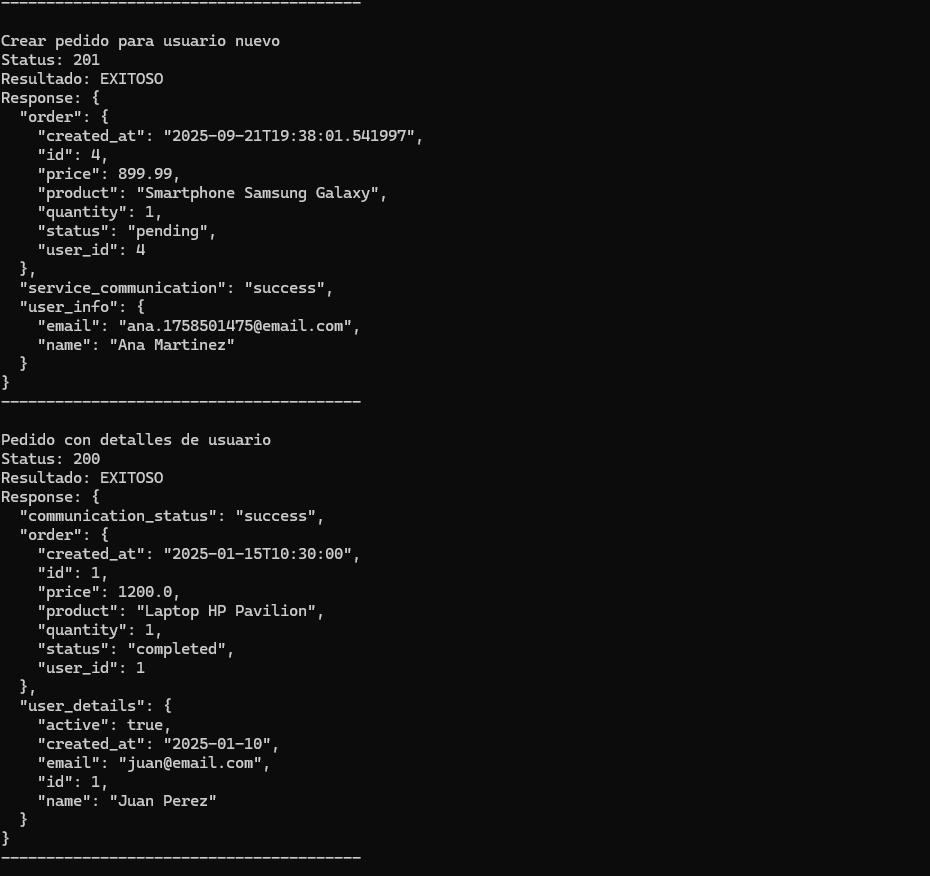

# Microservicios Demo - Python Flask

Implementación práctica de arquitectura de microservicios para Tarea 2. Demuestra comunicación entre servicios, validación distribuida y manejo de errores.

## Arquitectura

- **Servicio de Usuarios** (Puerto 5001): Gestión de usuarios y validaciones
- **Servicio de Pedidos** (Puerto 5002): Gestión de pedidos con comunicación al servicio de usuarios

## Tecnologías

- Python 3.13+
- Flask 2.3.3
- Requests 2.31.0

## Instalación

```bash
pip install flask requests
```

## Ejecución

```bash
# Terminal 1 - Servicio de Usuarios
cd users-service
python app.py

# Terminal 2 - Servicio de Pedidos
cd orders-service
python app.py

# Terminal 3 - Pruebas
cd tests
python test_microservices.py
```

## Endpoints

### Servicio de Usuarios (5001)
- `GET /health` - Estado del servicio
- `GET /users` - Listar usuarios activos
- `GET /users/{id}` - Usuario específico
- `POST /users` - Crear usuario

### Servicio de Pedidos (5002)
- `GET /health` - Estado con dependencias
- `GET /orders` - Listar pedidos
- `POST /orders` - Crear pedido (valida usuario)
- `GET /orders/{id}/details` - Pedido + datos del usuario

## Evidencias de Funcionamiento

### 1. Arquitectura Distribuida

*Dos microservicios corriendo independientemente en puertos 5001 y 5002*

### 2. Monitoreo de Servicios

*Health checks confirmando estado healthy y monitoreo de dependencias*

### 3. Separación de Responsabilidades

*Datos independientes: usuarios, pedidos y estadísticas*

### 4. Comunicación Entre Microservicios

*Endpoint que combina datos de ambos servicios - communication_status: success*

### 5. Verificación Inicial de Servicios

*Suite de pruebas iniciando verificación de health checks*

### 6. Pruebas Básicas - Usuarios

*Validación de funcionalidad básica del servicio de usuarios*

### 7. Usuario Específico

*Consulta individual de usuario por ID*

### 8. Lista Completa de Pedidos

*Gestión de pedidos con referencias a usuarios*

### 9. Estadísticas del Sistema

*Métricas y reportes del servicio de pedidos*

### 10. Comunicación Exitosa

*Creación de usuario y pedido demostrando comunicación entre servicios*

### 11. Manejo Robusto de Errores

*Validaciones para usuarios inexistentes y datos incompletos*

## Conceptos Demostrados

- Comunicación HTTP entre microservicios
- Validación distribuida de datos
- Manejo robusto de errores
- Monitoreo de servicios y dependencias
- Arquitectura escalable y resiliente

## Pruebas

El proyecto incluye suite completa de pruebas que valida:
- Health checks de ambos servicios
- Comunicación entre microservicios
- Manejo de errores y casos edge
- Creación y validación de datos